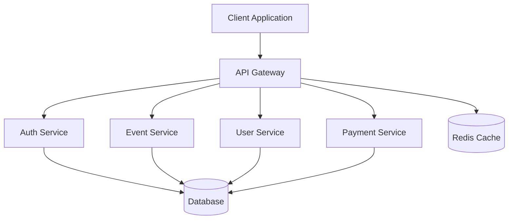

# System Design Specification

## Architecture Overview

### System Architecture

## Component Breakdown

### Frontend Architecture
1. **Presentation Layer**
   - React components
   - Material-UI themes
   - Responsive layouts

2. **State Management**
   - Redux store
   - React Query cache
   - Local storage

3. **Service Layer**
   - API clients
   - Authentication handlers
   - WebSocket connections

### Backend Architecture
1. **API Gateway**
   - Route management
   - Request validation
   - Rate limiting
   - Authentication middleware

2. **Microservices**
   - User Service
   - Event Service
   - Payment Service
   - Notification Service

3. **Data Layer**
   - PostgreSQL databases
   - Redis cache
   - S3 storage

## Security Architecture

### Authentication Flow
1. User authentication
2. JWT token generation
3. Role-based access control
4. Session management

### Data Security
1. Encryption at rest
2. SSL/TLS encryption
3. Input validation
4. XSS prevention
5. CSRF protection

## Scalability Design

### Horizontal Scaling
1. Load balancing
2. Service replication
3. Database sharding
4. Caching strategies

### Performance Optimization
1. CDN integration
2. Database indexing
3. Query optimization
4. Asset compression

## Deployment Architecture

### Container Orchestration
1. Docker containers
2. Kubernetes clusters
3. Service discovery
4. Auto-scaling

### CI/CD Pipeline
1. Automated testing
2. Code quality checks
3. Deployment stages
4. Rollback procedures

## Monitoring and Logging

### System Monitoring
1. Performance metrics
2. Error tracking
3. User analytics
4. Resource utilization

### Logging Strategy
1. Centralized logging
2. Log levels
3. Audit trails
4. Alert systems

## Disaster Recovery

### Backup Strategy
1. Database backups
2. File system backups
3. Configuration backups
4. Recovery procedures

### High Availability
1. Failover systems
2. Data replication
3. Backup services
4. Recovery time objectives 